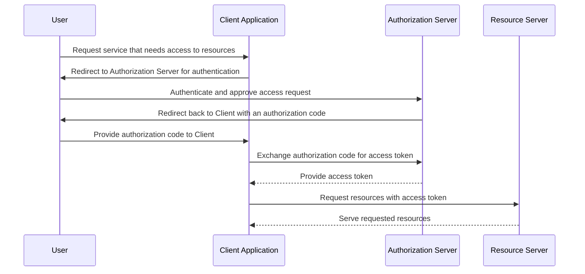

Title: API Tutorials for Complete Beginners

- Skill requirements: Basic Python knowledge

# Part 1: Introduction to APIs

## What is an API?

API is the acronym for Application Programming Interface — an intermediary that allows two applications to talk to each other. APIs are very important for creating interconnected software applications.

Analogy: API is like a *waiter* in a restaurant (`API`) taking orders (`requests`) from customers (`users`) and bringing back food (`responses`) from the kitchen (`server`). Without the waiter, the customers cannot order food and the kitchen staff cannot know any requests from the customers. Therefore, the waiters/APIs are crucial links for different people/applications to undertand and communicate with each other.

## Why Python for APIs?

Python is a great programming language for handling APIs for the following reasons:

- Simple: straightforward syntax and short learning curve are some of Python's strengths.
- Powerful libraries such as `requests`.
- Community support: Python is on the rise to become one of the most common languages in various use cases.

## Setting up environment

- Install Python
- Create a virtual env if needed.

E.g.

```bash
python3 -m venv myprojectenv
```

- Install `requests`.

## Make your first API call

Get your hands dirty, fast!

```python
import requests

# GET request
response = requests.get('https://jsonplaceholder.typicode.com/posts/1')

# Convert the response object to a dictionary
data = response.json()

print(f"Status code: {response.status_code}")
print(f"Complete response: {data}")
```

This code sends a GET request to the JSONPlaceholder API for a specific post and prints the response in JSON format.

The code returns the (fake) information:

```bash
Status code: 200
Complete response: {'userId': 1, 'id': 1,
 'title': 'sunt aut facere repellat provident occaecati excepturi optio reprehenderit',
  'body': 'quia et suscipit\nsuscipit recusandae consequuntur expedita et cum\nreprehenderit molestiae ut ut quas totam\nnostrum rerum est autem sunt rem eveniet architecto'}
```

## Understanding API responses

In the code above, the status code is 200. What does it mean?

The status code indicates whether your request was successful or not, and the JSON object contains the data you requested. More details on status codes will be explained in the next part.

The results are in JSON format: `{key}: {value}`. We can call the keys from the dictionary that we want. For example, the dictionary has the following key-value pair: `{userId:1}`.

```python
print(f"The User ID is: {data['userId']}")
```

This code will return: `The User ID is: 1`.

## Exercises - Your turn

You will have to fetch weather data from the OpenWeatherMap API.

Step-by-Step Instructions:

- First, you'll need to sign up for an API key from OpenWeatherMap:
  - Visit <https://openweathermap.org/> and create an account.
  - Navigate to the '**API keys**' tab on your account page.
  - Generate a new API key (note this down securely).
- Construct the request URL with the city name and API key. For example: Toronto ON.
- Make the request and parse the JSON response to extract and print specific weather information.

Your code will start like this:

```python
import requests

api_key = "your-api-key"
city = "Toronto"
url = f"http://api.openweathermap.org/data/2.5/weather?q={city}&appid={api_key}"

...
```

Check out my solution below.

# Part 2: Deep Dive into HTTP Methods and Handling API Responses

In this post, we will break down these concepts into simple terms, including n HTTP methods, handling API responses, and practical examples using Python's `requests` library.

## Understanding HTTP methods

### GET

A GET request is to **ask for the data** from the server. Take the exercise in previous part as example, you want to know the weather data for Toronto. You ask Open Weather Map by sending GET request, then they respond with the information in JSON format. You've completed the GET request task.

### POST

A POST request sends data to the server to **create or update** a current resource. This is like filling out a form or uploading data to a website.

### PUT

A PUT request will **replace current data with new ones**. It is like replacing a used paper towel with a new one. You do not add anything new, just replace the old or current one.

### DELETE

As the name suggests, DELETE requests are about **removing something**. It **deletes** the specified resource.

## Making API Calls with different HTTP methods

Uou can make these different types of API calls using Python's `requests` library (that's the convenient beauty of Python - simple and powerful libraries). 

Here are the syntax of API calls using `requests`:

- GET: `response = requests.get('https://api.example.com/data')`
- POST: `response = requests.post('https://api.example.com/data', data={'key': 'value'})`
- PUT: `response = requests.put('https://api.example.com/data/1', data={'key': 'value'})`
- DELETE: `response = requests.delete('https://api.example.com/data/1')`

## Handling JSON responses

**JSON** (JavaScript Object Notation) is a common format for sending and receiving data through APIs. Use `.json()` method to parse JSON response to a Python dictionary. For example:

```python
response = requests.get(url)
data = response.json() # convert JSON to a dictionary
print(data)
```

## Status codes

As mentioned in previous post, the status code (e.g. `200 OK`) helps to indicate whether your request was successful or not. It is important for us to understand what different HTTP **status codes** mean.

Use the `.status_code` parameter to check the status code of server's response. Google "HTTP status codes" for more detail.

Below are some common HTTP status code.

- `200 OK`: Success!
- `401 Unauthorized`: When authentication is required and has failed or has not yet been provided..
- `404 Not Found`: The server can't find the requested resource.
- `500 Internal Server Error`: A generic error message, indicating something went wrong on the server's side.

## Handling errors

When making API calls, it's crucial to handle errors based on the status codes. For example, you can check the status code of a response and respond accordingly:

```python
import requests

url = 'https://jsonplaceholder.typicode.com/posts/1'
response = requests.get(url)

if response.status_code == 200:
  data = response.json()
  print("Success!")
  print(data)
else:
  print("Failed to retrieve data")
```

## Exercises - Try it yourself

Let's get your hands dirty with practicing API calls for JSONPlaceholder at: <https://jsonplaceholder.typicode.com/>.

Your task is to get, post, replace, and delete (fake) data from the server of JSONPlaceholder with the guides below. Explain in your own words the results returned from the HTTP method calls.

- GET: /posts
- GET: /posts/1
- GET: /posts/1/comments
- GET: /comments?postId=1
- POST: /posts
- PUT: /posts/1
- PATCH: /posts/1
- DELETE: /posts/1

Quick question: What is the status code of the POST request? Is it 200?

Check out my sample solution below.

# Part 3: Authentication and security with APIs

## Introduction

This tutorial will help to give you basics of API authentication methods and security best practices.

## Understanding API Authentication

When working with APIs, we often need to prove who we are before we can use them. This process is called "authentication". It's like showing our ID before entering a club.

The purpose of API authentication is to ensure that only authorized people can access the resources. API authentication is important because it helps to protect sensitive data and user privacy from theft or misuse.

## Types of API Authentication

There are various methods of API authentication such as:

- Basic authentication using username and password, also called HTTP-based authentication.
- API key-based authentication.
- TLS Encryption using the TLS (Transport Layer Security) protocol.
- JWT-Based Authentication (JSON Web Tokens).
- OAuth 2.0, used by social media platforms like Facebook. This method allows third-party applications to access user data without exposing user credentials, by using access tokens.
- OpenID Connect (OIDC). This is considered the most advanced in this list. This method is similar to OAuth 2.0 but adding one more identity layer on top of it.

Other notable authentication methods include SAML, mTLS (mutual TLS), SCIM.

In this tutorials, we will look into two most common methods: API keys and OAuth.

## Using API Keys securely

One of the best practices of using API keys is that we should avoid hard-coding API keys, which means that you embed your API keys directly in code. When API keys are hardcoded into code, they become easily found by anyone who has access to the codebase. They can be then be stolen and misused.

There are two common solutions to ensure the secure storage of API keys: using environment variables and configuration files.

### Environment variables

The first method is to store your API keys in environment variables and access them in your Python scripts. This way, they're not exposed if someone looks at your code.

For example, suppose that you've set an environment variable named `'API_KEY'`. Here's how you call them in Python codes.

```python
import os
import requests

api_key = os.getenv('API_KEY')
url = "https://api.example.com/data"

# Add your API key in the request header
headers = {'Authorization': f'Bearer {api_key}'}

response = requests.get(url, headers=headers)
data = response.json()
print(data)
```

### Configuration files

Another method of securing your API keys is to use a config file that your script reads from, which is not included in version control (e.g., `.gitignore` for Git).

## OAuth 2.0

### How OAuth works

For a quick explanation of OAuth 2.0, please watch this video (less than 5 minutes): <https://www.youtube.com/watch?v=ZV5yTm4pT8g>.

Diagram showing how OAuth works:



### How to use OAuth 2.0 for a Python web app

Setting up OAuth 2.0 for a Python Django web app involves several steps. We can start with popular options like Google OAuth, Facebook Login, GitHub Apps or GitHub OAuth, or we can set up our own OAuth 2.0 server using libraries like `django-oauth-toolkit`. We will go into detail in another post.


## Practical exercise: Making an authenticated API request with OpenWeatherMap

Get back to the same exercise in the first tutorial: fetching weather data from OpenWeatherMap. But, this time, instead of hard-coding your API key directly into your script, you will store it in an environment variable. 

# Part 4: Advanced Features of the Requests Library

# Part 5: Building and Deploying a Simple Project Using an API

# Solutions to Exercises

## Open Weather Map API

Compare your solution with my Python code here: [Open Weather Map](openweathermap.py).

Code snippet:

```python
import requests

api_key = "your-api-key"
city = "Toronto"
url = f"http://api.openweathermap.org/data/2.5/weather?q={city}&appid={api_key}"

response = requests.get(url)
print(f"Status: {response.status_code}")

# Convert the response object to a dictionary
data = response.json()

print(f"\nTotal data: {data}")

print(f"\nWeather in {city}: {data['weather'][0]['description']}.")
```

## HTTP method calls with JSONPlaceholder API

Check my Python code here: [HTTP methods](http_methods.py).

Code snippet:

```python
import requests

url = 'https://jsonplaceholder.typicode.com/posts/1'
getResponse = requests.get(url)
print(f"Status code of GET request: {getResponse.status_code}")
print(getResponse.json())

url = 'https://jsonplaceholder.typicode.com/posts'
data = {'userId': 1, 'title': 'New Post', 'body': 'Post content here.'}
postResponse = requests.post(url, json=data)
print(f"\nStatus code of POST request: {postResponse.status_code}")
print(postResponse.json())

url = 'https://jsonplaceholder.typicode.com/posts/1'
data = {'userId': 1, 'id': 1, 'title': 'Updated Title', 'body': 'Updated post content.'}
putResponse = requests.put(url, json=data)
print(f"\nStatus code of PUT request: {putResponse.status_code}")
print(putResponse.json())

url = 'https://jsonplaceholder.typicode.com/posts/1'
deleteResponse = requests.delete(url)
print(f"\nStatus code of DELETE request: {deleteResponse.status_code}")
print(deleteResponse.json())
```