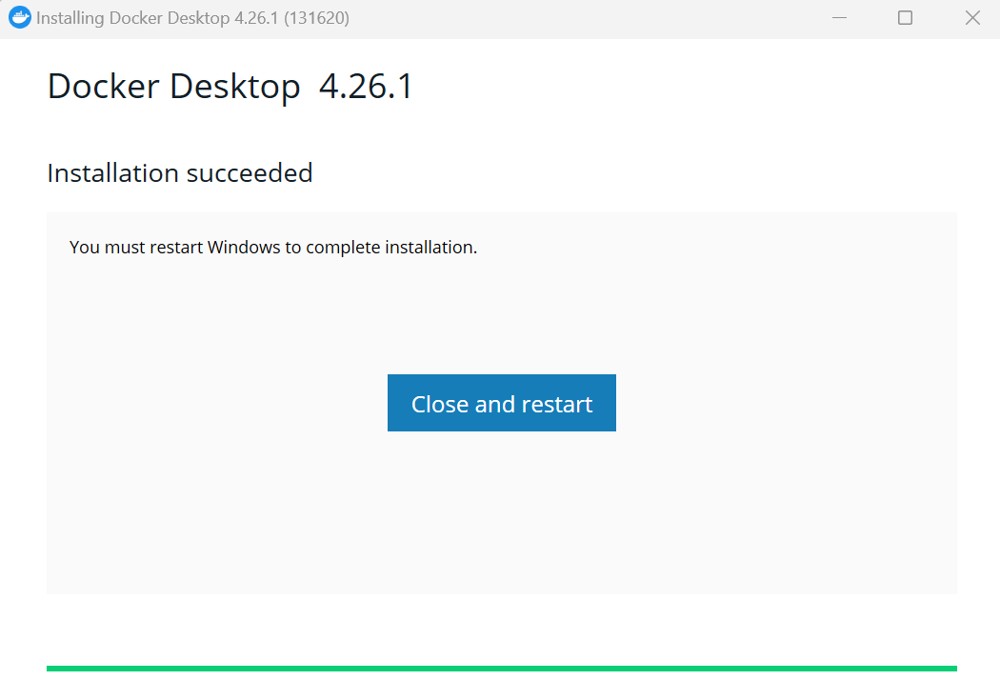
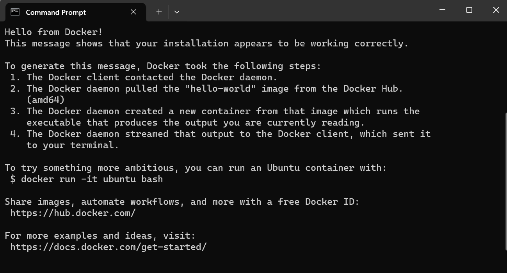
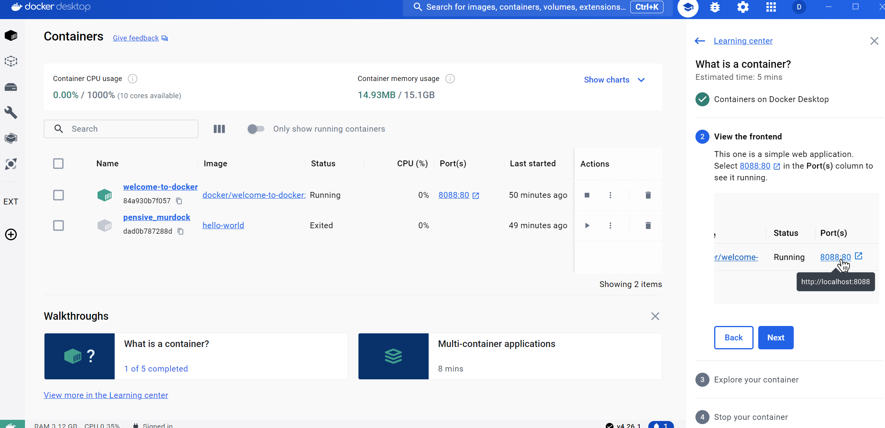
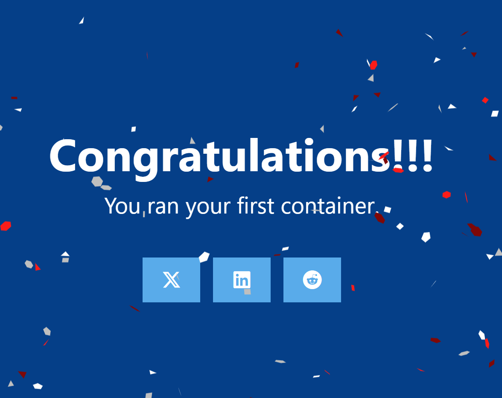
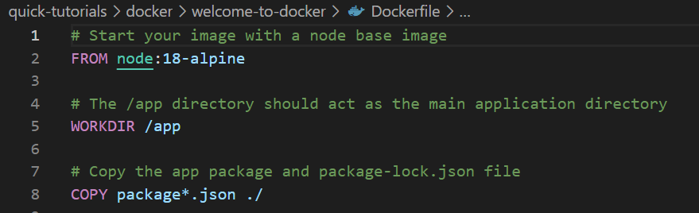
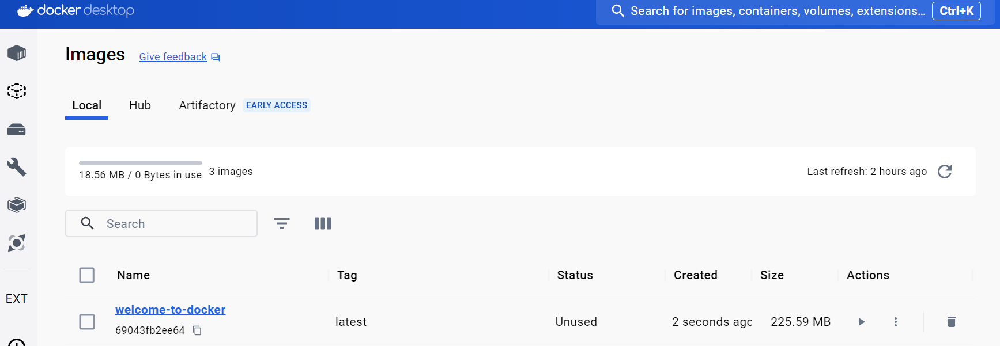
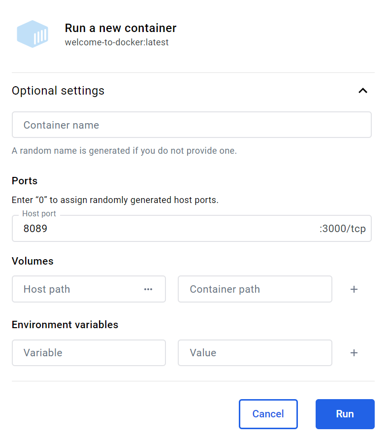
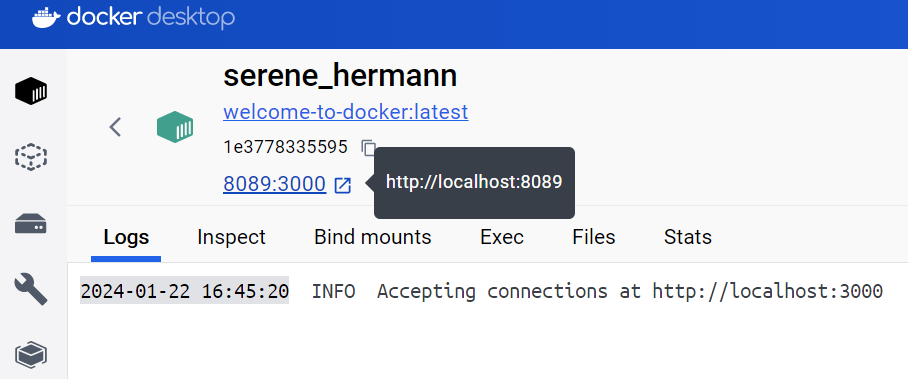

# Introduction to Docker

## References:

Some good resources to learn more about Docker:
- [Docker Official Documentation](https://docs.docker.com/guides/get-started/).
- [DE Zoomcamp by DataTalksClub - 24 minutes - FREE](https://youtu.be/EYNwNlOrpr0?si=sqlXisduRe3plhkM).
- [Docker Fundamentals course by Cantrill - FREE](https://learn.cantrill.io/p/docker-fundamentals).
- [Docker Fundamentals YouTube playlist by Cantrill - FREE](https://www.youtube.com/playlist?list=PLTk5ZYSbd9Mg51szw21_75Hs1xUpGObDm).

## Step-by-Step Installation

### Download Docker Desktop for Windows:

- Visit the Docker website and download Docker Desktop for Windows.
- You need to create a Docker account if you don’t have one already.

### Install Docker Desktop:

- Run the installer you downloaded.
- Follow the install wizard to accept the license, authorize the installer, and proceed with the install.
- You will be prompted to authorize Docker.app with your system password during the install process.
- Once it's complete, you will see the message as below.


### Configure WSL 2:

- During installation, you may be prompted to enable **Windows Subsystem for Linux version 2 (WSL 2)** and download a Linux kernel update package if WSL 2 is not already installed.
- If you are using VS Code editor, you will be prompted to install the **WSL extension** in VS Code.

### Configure Docker:

- Docker starts automatically once the installation is complete.
- Docker will ask you to log in with your Docker account. Use the Docker ID and password you created when you downloaded Docker.

### Verify installation:

- Open a command prompt or PowerShell window.
- Run the following command to check if Docker is installed and running:
```bash
docker --version
```

### Run your first container:

- You can test Docker by running a simple container to verify that Docker can pull and run *images*.
- Open a command prompt or PowerShell and run the following command:
```bash
docker run hello-world
```
- Docker will download and run a small test *image*. If successful, you'll see a message indicating that your installation appears to be working correctly.

- If you follow the walkthrough instructions on "Docker Desktop" to create the first container, you will select `8088:80`⁠ in the Port(s) column to see it running.

- You'll see the message at port `http://localhost:8088:80`on the browser as below.



**Congratulations!** Now you have Docker installed and running on your Windows machine. You can start using it to containerize applications, including databases, data processing tools, and more.

## Using Docker on Windows:

- **Docker CLI**: Use Docker commands in your terminal to pull images, run containers, and manage Docker.
- **Docker Compose**: Docker Desktop includes Docker Compose for defining and running multi-container Docker applications.
- **Docker Desktop Dashboard**: Provides a simple interface to manage your containers, images, networks, and volumes.

## Basic Docker Commands
- `docker pull [image]`: Pulls an image from Docker Hub.
- `docker run [image]`: Runs a container from an image.
- `docker ps`: Lists running containers.
- `docker images`: Lists images that are locally stored with the Docker engine.
- `docker stop [container-id]`: Stops a running container.

## Best Practices for Using Docker on Windows

- Regularly update Docker to the latest version to get new features, bug fixes, and security patches.
- Use **Docker Volumes** for persistent data storage.
- Be aware of the differences between Linux and Windows containers, especially if you are developing cross-platform applications.
- Utilize **Docker Compose** for managing multi-container applications.

## How to run a container from a single image:

**Credit:** Docker Desktop's walkthrough instruction. 

In this guide, you create an image using a Dockerfile and a sample application.

### Get the sameple applicaiton:

- Clone the repository at https://github.com/docker/welcome-to-docker⁠.
```bash
git clone https://github.com/docker/welcome-to-docker
```
- Run the following command before moving on.
```bash
cd welcome-to-docker
```

### Verify your Dockerfile:

- Open the sample application in your IDE (e.g. VS Code). Note that it already has a Dockerfile. For your own projects you need to create this yourself.


### Build your first image:

- You can build an image using the following docker build command via a CLI in your project folder.

```bash
docker build -t welcome-to-docker .
```
Explain the command: The `-t` flag tags your image with a name. (welcome-to-docker in this case). And the `.` (dot) lets Docker know where it can find the Dockerfile.

### Run your container:

- Once the build is complete, an image will appear in the **Images** tab in Docker Desktop.


- Select the image name to see its details. Select **Run** to run it as a container. In the Optional settings remember to specify a port number (something like `8089`).


### View the frontend:

- You now have a running container. 
- If you don't have a name for your container, Docker provides one. View your container live by selecting the link below the container's name.

- You'll see the message at port `http://localhost:8089/`on the browser as below.


