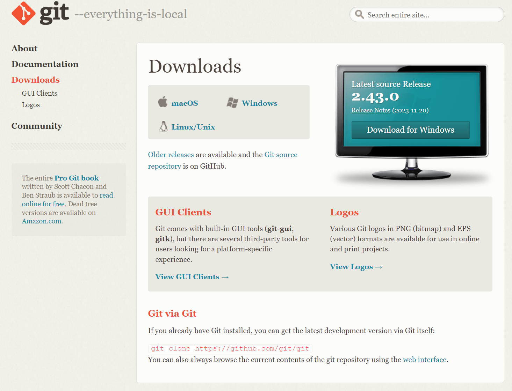

# How to use Git & GitHub

## Table of Contents:

1. [Installing and configuring Git](#installing-and-configuring-git)
1. [Creating a local repo and initializing Git](#creating-a-local-repo-and-initializing-git)
1. [Push the local changes to GitHub repo](#push-the-local-changes-to-github-repo)
1. [Other Tips and Resources](#other-tips-and-resources)
1. [Troubleshooting](#troubleshooting)
1. [Acknowledgements](#acknowledgements)

## Installing and configuring Git

### Step 1: Install Git:

- If you haven't already, the first thing you need to do is install Git on your computer.
- You can download Git for your specific operating system from the official website: https://git-scm.com/downloads. Follow the installation instructions for your platform.


### Step 2: Configure Git:

- Once Git is installed, you need to configure Global Git account with your name and email address.
- Note that, in order to show your contribution to GitHub commits, you have to use your GitHub's username/email. For example, my GitHub username and email are: longbytes and <my-email@example.com>.
- Open your command prompt or terminal and enter the following commands, replacing Your Name and youremail@example.com with your GitHub's username/email

```bash
git config --global user.name "your-github-username"
git config --global user.email "your-github-email@example.com"
```

- You can update all Git repositories to use "`main`" as the primary branch name with this command: 

```bash
git config --global init.defaultBranch main
```

- You can check your current Git configuration by running the following command:

```bash
git config --list
```

Then, you should see the message returned:

```bash
user.name=<your-github-username>
user.email=<your-github-email@example.com>
init.defaultbranch=main
```

## Creating a local repo and initializing Git

### Step 1: Create a local repo:

- Now, let's create a new local directory where you want to store your project files. 
- Open your terminal and navigate to the directory where you want to create your project. You can use the `cd` (change directory) command to navigate.
- For example, to create a directory named "my_project" and navigate into it, you can use these commands:

```bash
mkdir my_project
cd my_project
```

### Step 2: Initialize a Git repository:

- Inside your project directory, you need to initialize a Git repository. This is where Git will track your changes and version control your project.

```bash
git init
```

- Then, make sure that you have a clean folder --checking with the command:

```bash
git status
```

### Step 3: Create files and folders:

- You can create files and folders in your project directory using your favorite text editor or code editor. 
- For example, to create a new text file named "README.md," you can use:
  - Windows OS: `echo. > README.md`
  - Bash: `touch README.md`

### Step 4: Add files to the staging area:

- To start tracking your files with Git, you need to add them to the staging area. You can do this using the `git add` command.

```bash
git add README.md
```

- If you have multiple files to add, you can use a wildcard to add all files in the current directory:

```bash
git add .
```

### Step 5: Commit your changes 

- After adding files to the staging area, you need to commit them to the Git repository. 
- This creates a new version of your project with the changes you've made.

```bash
git commit -m "Initial commit"
```

- Replace "`Initial commit`" with a meaningful message that describes what you did in this commit.

## Push the local changes to GitHub repo

### Step 1: Create a GitHub Repository

- Now, go to the GitHub website (https://github.com/) and log in or create an account if you don't have one.
- Once logged in, click the '+' icon in the top right corner and select "New repository." Follow the instructions to create a new repository on GitHub.

### Step 2: Link local and remote repositories

- After creating your GitHub repository, you'll see a set of instructions for pushing an existing repository from the command line.
- Follow these instructions in your terminal. It usually involves running commands like:

```bash
git remote add origin https://github.com/yourusername/your-repository.git
git branch -M main
git push -u origin main
```

- Replace `yourusername` with your GitHub username and `your-repository` with the name of your GitHub repository.

### Step 3: Verify on GitHub

Now, if you visit your GitHub repository in your web browser, you should see the files and folders you added from your local directory.

### Congratulations!

You've created a local Git repository, added files, and pushed them to GitHub.

## Branching & Merging

This section is about working with branches, changes, and merging.

### Why do we need to use Branching?

- Branching is a safe method to try out solutions and make mistakes without affecting the original codes. 
- If your solutions do not work out, you can simply delete that branch and start over with another branch.
- If you're happy with the tested solution and confident that it will not cause any issues, then you can merge your code into the `main` branch.

### Naming conventions for Branches

- For existing projects/repositories, check out the `CONTRIBUTING.md` file for any guidelines.
- Good naming convention: Initials of the developer in front of each branch before a short description of code modifications (GitHub for Dummies 2ed, page 80), connecting by hyphens in between.
- Example: John Doe is the developer.
  - `JD-add-login-feature`.
  - `JD-fix-data-sync-issue`.
  - `JD-fix-payment-processing-bug`.

## Other Tips and Resources

### Cheat Sheets

For more information on how to use Git, check out the following resources:

- **Git Cheat Sheet** (PDF): <https://education.github.com/git-cheat-sheet-education.pdf>.
- **The Visual Git Cheat Sheet**: <https://ndpsoftware.com/git-cheatsheet.html#loc=index>;.
- **Git Docs page**: <https://git-scm.com/doc>.

### Clear space in Terminal/Bash

If your terminal starts to get too cluttered with a long list of commands and results returned, you can clear the space by using the command: `cls` or `clear`.

## Troubleshooting

### Error: `error: src refspec main does not match any`. 

#### Description: 

- When I try to push to my github using: git push -u origin main, I got this error: `error: src refspec main does not match any`. 

#### Why?

- Git is unable to find a branch named "main" in your local repository.
- You haven't created a branch with the name "main" or it might be called something else, like "master," which is a common default branch name.

#### Solutions:

1. Check your current branch: `git branch`. Before pushing, it's essential to confirm the name of the branch you're currently on in your local repository.
1. Use the correct branch name: `git push -u origin master`. Replace "`master`" with the actual branch name you're working on.
1. Rename your branch (optional): If you intended to use the "`main`" branch and you're not currently on it, you can rename your current branch to "`main`" if that aligns with your project's naming conventions. For example, to rename the current branch to "`main`," you would use: `git branch -m main`. Then, you can use the `git push -u origin main` command to push to the "main" branch on GitHub.
1. Restart the command line editor and then test pushing commits to GitHub. Refresh the GitHub website to verify. 

## Acknowledgements

- Book: **GitHub for Dummies 2nd edition** by Sarah Guthals, PhD.
