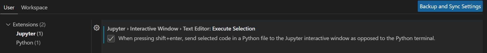

# Visual Studio Code

## How to set up VS Code for Data Science

### Useful Extensions

#### 1. Python Extension Pack

- Author: Don Jayahmanne.
- Why it's good: Includes installations of 7 useful individual extensions such as: autoDocstring, ItelliCode, Python, Python Indent, Python Environment Manager, Django, Jinja.

#### 2. Pylance

- Author: Microsoft.
- Why it's good: "Supercharge your Python IntelliSense experience with rich type information, helping you write better code faster" (from its introduction).

#### 3. Jupyter

- No need to say more about this!

#### 4. CodeSnap

- Author: adpyke.
- Why it's good: "Take beautiful screenshots of your code in VS Code!"

#### 5. Path Intellisense

- Author: Christian Kohler.
- Why it's good: Helps to autocomplete filenames.

### Useful Extensions for Web Dev

1. Prettier
1. Emmet 
1. Auto Rename Tag - author: Jun Han.
1. Bracket Pair Colorizer - author: CoenraadS
1. JavaScript (ES6) code snippets
1. Live Server

### Other Extensions

#### 1. Markdown Preview GitHub Styling

- Author: Matt Bierner
- See how the Markdown (.md) file will look like on GitHub.

### VS Code Settings

#### 1. Jupyter - Interactive Window

- In `Settings > Users`, search for Jupter Interactive Window as the screenshot.

- Select: `When pressing shift+enter, send selected code in a Python file to the Jupyter interactive window as opposed to the Python terminal.`
- Purpose: To send selected code in Python to Jupyter Notebook.

#### 2. Setting the Line Length Indicator

- Go to "`Settings`" (Windows: `Ctrl + ,`). In the dialog, search for `rulers`.
- Select `Edit in settings.json`.
- In the json file, add the following to the `editor.rulers` setting:

```json
"editor.rulers": [
    80,
]
```

- This will add a vertical line in the editing window at the 80th character position. (Reference: **Python Crash Course 3rd Edition** by Eric Matthes.)

### VS Code Shortcuts

Reference: **Python Crash Course 3rd Edition** by Eric Matthes, Appendix B.

#### 1. Indenting and Unindenting Code Blocks

- Indent: Highlight the entire code blocks => press: `Ctrl + ]`.
- Unindent: Highlight the entire code blocks => press: `Ctrl + [`.

#### 2. Commenting Out Code Blocks

- In case that you want to disable a block of codes, highlight codes => press `Ctrl + /`.
- Press `Ctrl + /` one more time to undo this task.

#### 3. Moving Lines Up and Down

- Highlight the code lines or blocks => press `Alt + up arrow` to move up and `Alt + down arrow` to move down.