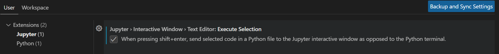

# Visual Studio Code

## How to set up VS Code for Data Science

### Useful Extensions

#### Python Extension Pack

- Author: Don Jayahmanne.
- Why it's good: Includes installations of 7 useful individual extensions such as: autoDocstring, ItelliCode, Python, Python Indent, Python Environment Manager, Django, Jinja.

#### Pylance

- Author: Microsoft.
- Why it's good: "Supercharge your Python IntelliSense experience with rich type information, helping you write better code faster" (from its introduction).

#### Jupyter

- No need to say more about this!

#### CodeSnap

- Author: adpyke.
- Why it's good: "Take beautiful screenshots of your code in VS Code!"

#### Path Intellisense

- Author: Christian Kohler.
- Why it's good: Helps to autocomplete filenames.

### VS Code Settings

#### Jupyter - Interactive Window

- In `Settings > Users`, search for Jupter Interactive Window as the screenshot.

- Select: `When pressing shift+enter, send selected code in a Python file to the Jupyter interactive window as opposed to the Python terminal.`
- Purpose: To send selected code in Python to Jupyter Notebook.